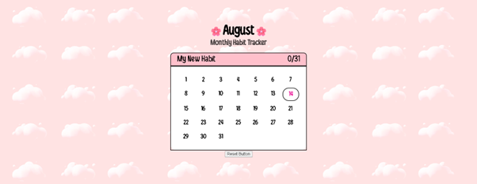
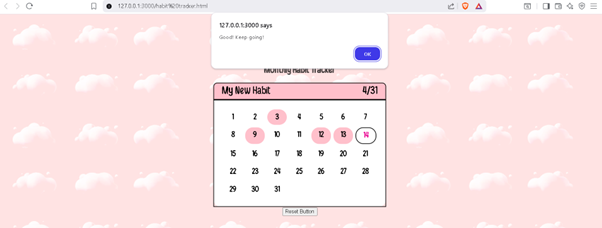

# 🌸 Habit Tracker Calendar

A simple **habit tracking calendar** built with **HTML, CSS, and JavaScript** that helps you track your daily progress for any habit throughout the month.  
It stores progress in **localStorage** so your data stays even after refreshing the page.

---

## ✨ Features
- 📅 Displays the current month and dates dynamically
- 🌸 Allows you to set a habit title
- 🖱 Click on any day to mark it as **completed** or **incomplete**
- 💾 Progress is saved automatically in your browser's localStorage
- 📊 Shows a daily/total progress counter
- 🎉 Two motivational alerts:
  - **Daily**: "Good, keep going!" (when you complete a day’s task)
  - **Monthly**: "Great progress!" (when you complete the whole month)
- 🔄 Reset button to clear all progress for the month

---

## 📂 Project Structure
Habit Tracker/
│   README.md
│   index.html
│   style.css
│   script.js
└── screenshots/
    ├── initial-view.png
    └── progress-view.png

## 🚀 How to Use
1. Clone or download the repository:
   ```bash
   git clone https://github.com/<your-username>/habit-tracker.git

2. Open index.html in your browser.

3. Click the habit title to set your desired habit.

4. Click on a date to mark it as completed (pink) or incomplete (white).

5. Track your progress with the counter at the top.

🛠 Technologies Used

- HTML – Structure
- CSS – Styling
- JavaScript – Functionality and data handling

📸 Screenshots

### 1️⃣ Initial View


### 2️⃣ With Progress



📌 Future Improvements

- Allow multiple habits at once
- Add weekly progress charts
- Export/import progress data
- Dark mode support

❤️ Contributing

Pull requests are welcome!
For major changes, please open an issue first to discuss what you’d like to change.

